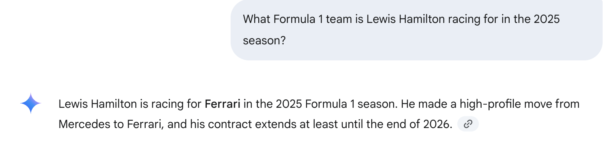
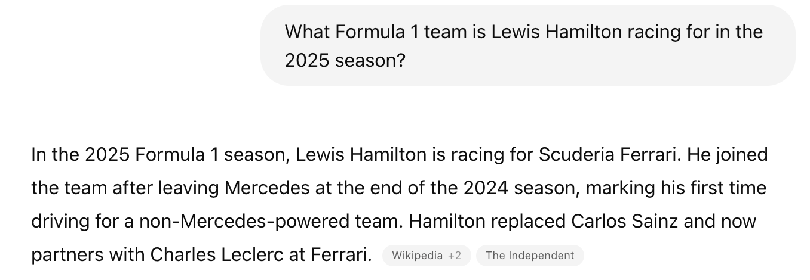
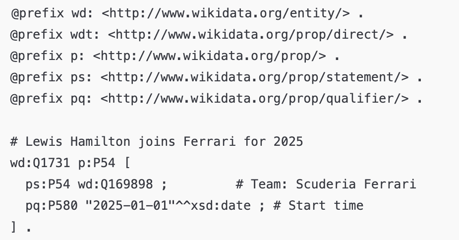
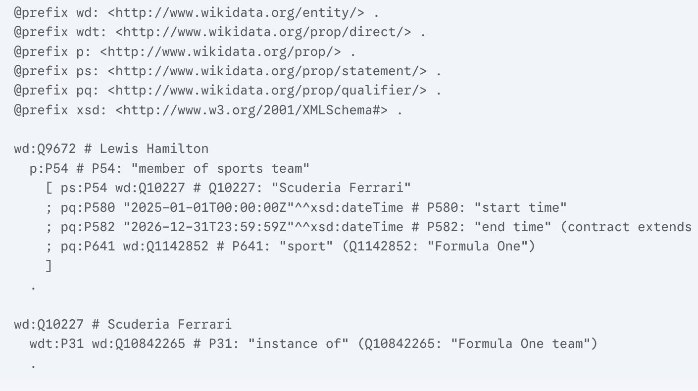
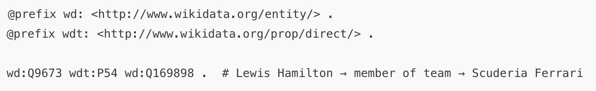

# 🏎️ Lewis Hamilton (Q9673)


## 👤 Who is Lewis Hamilton?

**Lewis Hamilton** is a legendary British Formula 1 driver, widely regarded as one of the greatest in the sport's history. He is a **seven-time World Champion**, tied with Michael Schumacher, and has raced for McLaren and Mercedes for most of his career.

We chose Hamilton as a case study because of his **high visibility**, his **recent team change to Ferrari** (starting from 2025), and the **importance of having his Wikidata profile up to date**.

---

## 🧪 SPARQL Query: Detecting the Gap

We ran the following SPARQL query to extract **nationality** (`P27`) and **team** (`P54`) information using a `UNION`, as required by the project. This helped us evaluate what is already in Wikidata.

### 📄 SPARQL Query

```sparql
SELECT DISTINCT ?driver ?driverLabel ?infoLabel
WHERE {
  VALUES ?driver {
    wd:Q9673 wd:Q17541912 wd:Q112073790 wd:Q2239218
  }
  {
    ?driver wdt:P27 ?info .
  }
  UNION
  {
    ?driver wdt:P54 ?info .
  }
  SERVICE wikibase:label { bd:serviceParam wikibase:language "en". }
}
ORDER BY ?driverLabel
```

📎 [Results](https://w.wiki/EEnK)

---

## ❗ Gap Discovered

From the query, we found that **Lewis Hamilton's recent move to Ferrari in 2025 is missing from Wikidata**. There is no triple like:

```turtle
wd:Q9673 wdt:P54 wd:Q10227 .  # Lewis Hamilton → Scuderia Ferrari
```

---

## 🤖 Zero-Shot Prompts to LLMs

We asked two different Large Language Models the same question:

> **Q:** What Formula 1 team is Lewis Hamilton racing for in the 2025 season?

### 💬 Gemini Response



Gemini correctly identified that Hamilton joined **Ferrari** in 2025 after leaving Mercedes.

---

### 💬 ChatGPT Response



ChatGPT also confirmed the move to **Scuderia Ferrari**, mentioning the ongoing contract until the end of 2026.

---

## 🧱 RDF Generation Attempt by LLMs

We then asked both models to produce **RDF triples using Wikidata ontology** to represent this information.

### ⚠️ Initial Output (Incorrect)

Both models produced RDF with incorrect Q-IDs or structure:





---

## ✅ Corrected RDF (Manually Refined)

After verifying and correcting the Q-IDs and structure, we manually constructed the **correct triple**:



---

## 📌 Conclusion

Using a simple SPARQL `UNION` query, we discovered that **an important fact about Hamilton's 2025 season was missing from Wikidata**.  
LLMs helped us retrieve the knowledge, but their RDF outputs required **manual corrections**.

This case illustrates both the **potential and limitations of LLMs** in knowledge graph enrichment.
