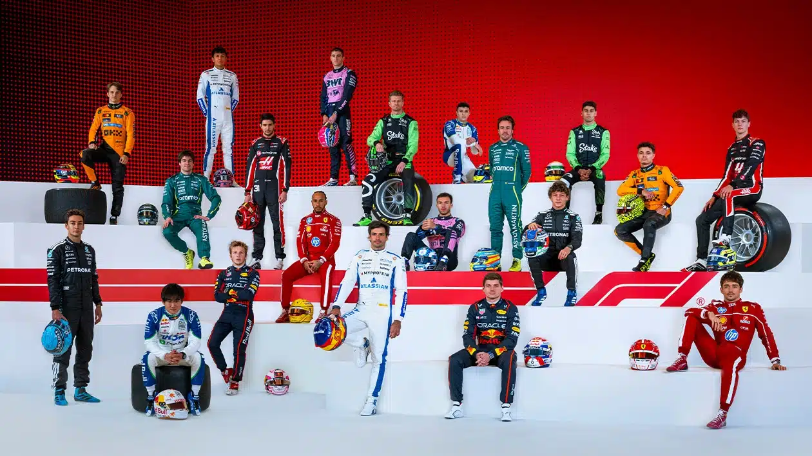

# 🏎️ Project Topic: Enriching Wikidata with Formula 1 Driver Knowledge

  

## 🎯 Why Formula 1?

Formula 1 is not just a sport — it's a global cultural phenomenon with over 1.5 billion viewers worldwide and a growing fanbase among younger generations, especially thanks to Netflix’s *Drive to Survive*. It features international races, high-performance teams, and iconic drivers that shape modern motorsport.

We selected Formula 1 for this project because:

- It is **extremely popular in Italy**, home to **Scuderia Ferrari**, one of the most legendary and loved teams in the sport.
- It provides a **rich structure of entities** (drivers, teams, championships, events) ideal for semantic analysis.
- It combines both **hard data** (dates, team changes, wins) and **soft facts** (relationships, background info).
- Many details — even well-known — are often **missing or incomplete in Wikidata**, making it a perfect case for enrichment.

---

## 🧠 Why Wikidata?

  

**Wikidata** is a structured, collaborative knowledge base that powers applications like Google Search, virtual assistants, and AI research. Its open RDF model makes it ideal for our goal: integrating verified knowledge with automatically generated triples.

However, even in a public, living dataset like Wikidata, **incompleteness is a reality** — especially when facts evolve rapidly, such as:
- New F1 driver contracts
- Latest championship results
- Personal relationships not yet recorded

Our project uses Wikidata as the **central hub** for verifying and enriching driver data using SPARQL and LLMs.

---

## 👤 Selected Drivers

  

We focused on 4 drivers:

- **Lewis Hamilton** (Q9673) – 7-time world champion, recently moved to Ferrari
- **Charles Leclerc** (Q17541912) – rising star and Ferrari’s current lead driver
- **Kimi Antonelli** (Q112073790) – a young Mercedes talent expected to debut in F1
- **Max Verstappen** (Q2239218) – reigning champion with Red Bull Racing

This mix allowed us to work across:
- High-profile public data (Hamilton, Verstappen)
- Emerging drivers with sparse data (Antonelli)
- Personal facts often left out (Leclerc)

---

## 🧩 Identifying the Gaps

Using SPARQL, we uncovered several **important gaps** in Wikidata:

- ❌ Hamilton's confirmed transfer to Ferrari in 2025 was **not listed**
- ❌ Verstappen’s win of the 2024 World Championship was **missing**
- ❌ Antonelli had **no team** despite media confirmation
- ❌ Leclerc’s relationship was **not represented**, though publicly known

These cases formed the **core of our enrichment efforts**.

---

## 📌 Goal

Our goal is to **bridge gaps in semantic knowledge** by combining:

- Powerful **SPARQL queries**
- Insightful **LLM prompting**
- Manual **RDF triple correction**
- A clear, open-access **GitHub Pages website**

This project aims to demonstrate how **automated tools and human validation** can work together to improve the quality of large-scale knowledge graphs.
